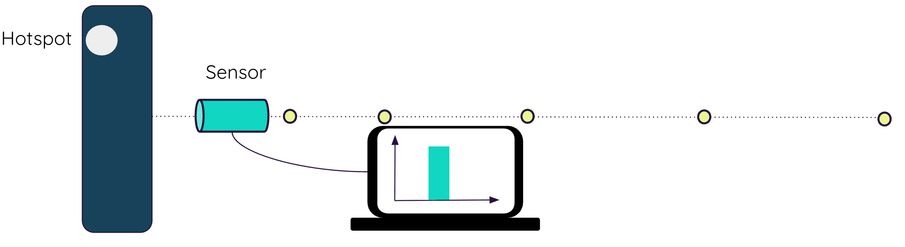

# Radiation Sensor Placement Demo



Synthetic simulation toolkit for studying detector count-rate behavior around a fixed sample box with varying source activity, with:

- A core physics-inspired simulator (`simulator/core.py`)
- DOE sampling utilities (`simulator/sampling`)
- Batch dataset generation (`simulator/batch.py`)
- A Streamlit UI for interactive runs (`app/streamlit_app.py`)

## Requirements

- Python `3.10+`

## Quickstart

```bash
cd radiation-sensor-placement-demo
poetry install
```

Run tests:

```bash
poetry run pytest -q
```

Run the app:

```bash
poetry run streamlit run app/streamlit_app.py
```

## Minimal Python Usage

```python
import numpy as np
from simulator import Box, Detector, Hotspot, simulate_measured_activity

box = Box(Lx=0.10, Ly=0.04, Lz=0.10)
det = Detector(area_m2=2.5e-4, efficiency=0.2, background_cps=1.5, dwell_s=2.0)
hs = Hotspot(
    width_x_m=0.05,
    depth_y_m=0.02,
    height_z_m=0.05,
    mean_activity_bq=2e5,
    size_sigma_m=0.003,
)

distances = np.array([0.025, 0.05, 0.10, 0.15, 0.20])
expected_cps, measured_cps = simulate_measured_activity(
    distances,
    box=box,
    detector=det,
    hotspot=hs,
    mu_material_m_inv=8.0,
    fov_half_angle_deg=30.0,
    noise="poisson",
)

print(expected_cps)
print(measured_cps)
```

## Batch Dataset Generation

`run_design(...)` generates two tables:

- `inputs_df`: sampled quantities of interest and fixed source settings
- `measurements_df`: measured count-rate columns per candidate distance (`cps_d_...m`)

Example:

```python
import numpy as np
from simulator import Box, Detector
from simulator.batch import run_design

inputs_df, measurements_df = run_design(
    distances_m=np.array([0.025, 0.05, 0.1, 0.15]),
    box=Box(Lx=0.10, Ly=0.04, Lz=0.10),
    detector=Detector(area_m2=2.5e-4, efficiency=0.2, background_cps=1.5, dwell_s=2.0),
    bounds={
        "mean_activity_bq": (1e4, 1e6),
    },
    fixed_params={
        "width_x_m": 0.05,
        "depth_y_m": 0.02,
        "height_z_m": 0.05,
        "size_sigma_m": 0.003,
    },
    n_samples=200,
    strategy="lhs",
    seed=0,
    mu_material_m_inv=8.0,
    fov_half_angle_deg=30.0,
    noise="poisson",
)
```

## Project Layout

```text
app/                  # Streamlit app
simulator/
  core.py             # Simulation model and domain dataclasses
  batch.py            # Batch generation over sampled inputs
  sampling/designs.py # random/LHS/Sobol samplers
  tests/              # Pytest coverage for core + sampling
```
